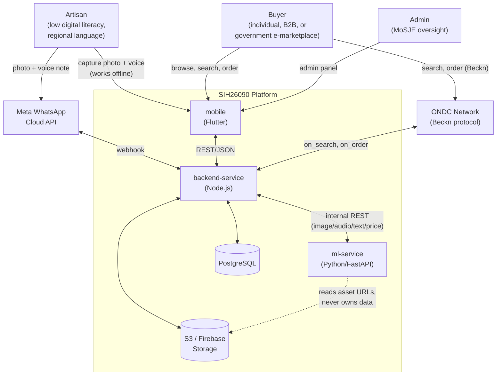
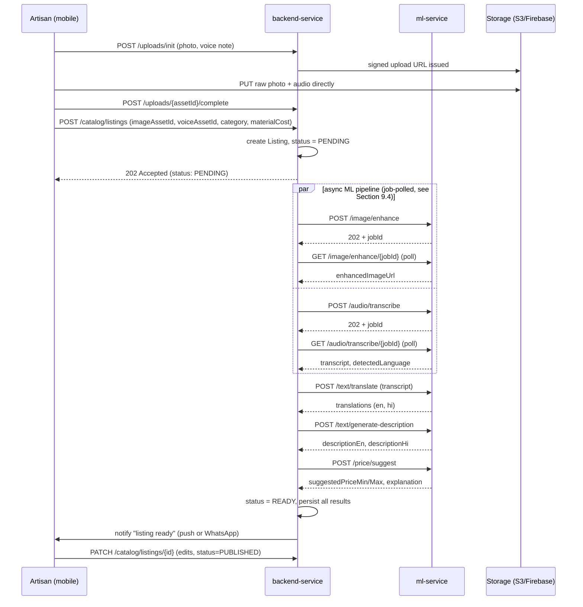
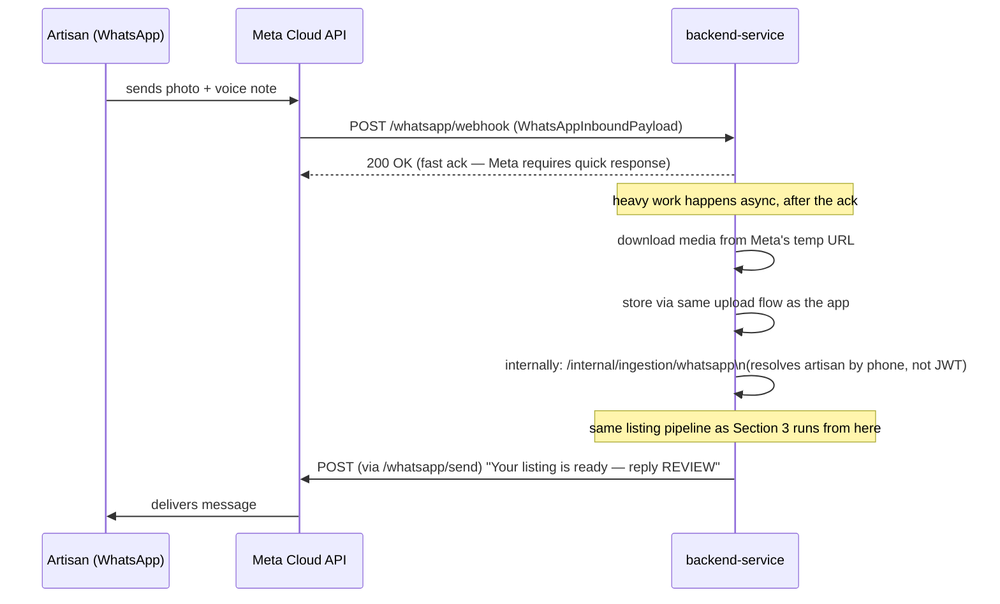
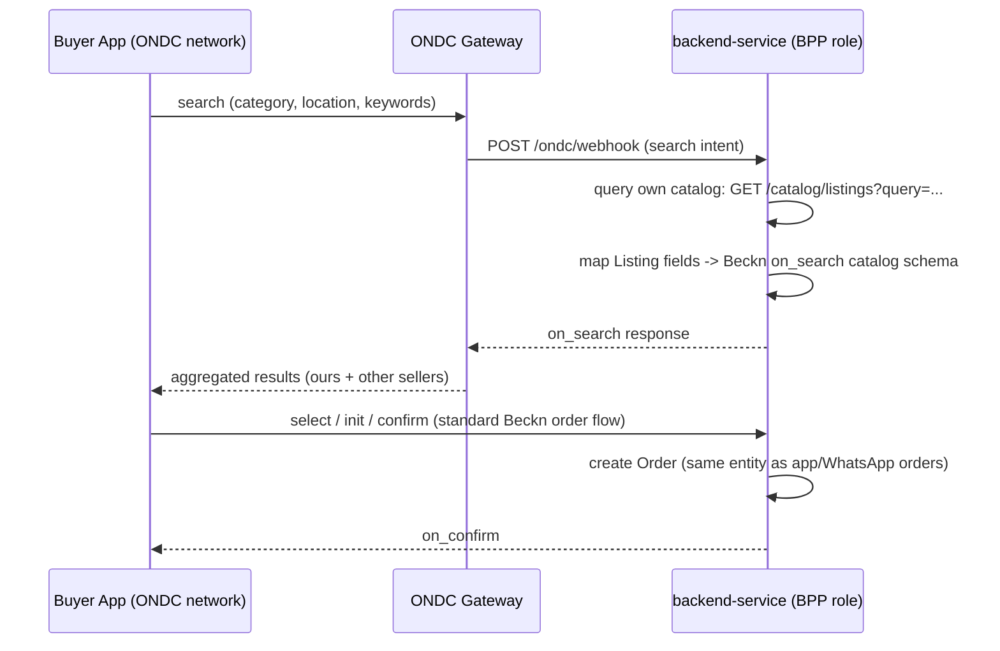
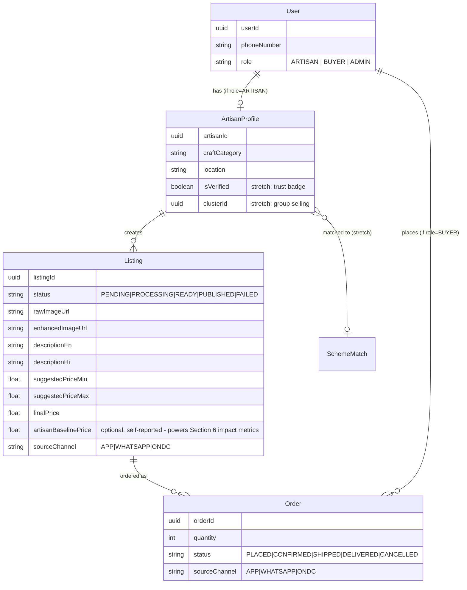
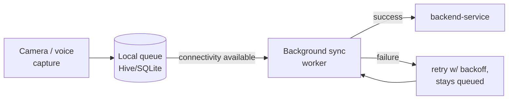

# SIH26090 — System Architecture

**AI-Driven Market Linkage & Smart Cataloging App for Marginalized Artisans**

This is the technical reference for how the system fits together — service boundaries, data flow, contracts, non-functional stance, and the honest list of what's built vs. still a stub. See [`ROADMAP.md`](ROADMAP.md) for the build plan and [`Srijan.pdf`](Srijan.pdf) for the product charter.

---

## 1. System context



**Two backend services, matching two backend developers.** `backend-service` is the only service that talks to the database — it owns auth, catalog/order CRUD, admin, WhatsApp, ONDC, notifications, and orchestration. `ml-service` is a stateless inference worker with no persistence and no business logic; it only transforms inputs to outputs and hands results back.

This replaces an earlier 3-service split (a separate Spring Boot core API + Node.js realtime layer + Python ML). It was consolidated once actual headcount settled at 2 backend developers — see `ROADMAP.md`'s architecture change log for why.

---

## 2. Service breakdown

| Service | Stack | Owns | Talks to DB? |
|---|---|---|---|
| `backend-service` | Node.js / Express | Auth, artisan profiles, catalog, orders, admin, WhatsApp, ONDC connector, notifications, orchestration | **Yes** — only service that does |
| `ml-service` | Python / FastAPI | Image enhancement, ASR, translation, description generation, price suggestion | No — stateless worker |
| `mobile` | Flutter | Capture UI, offline queue, catalog browse, review-and-publish, impact dashboard | No — client only |

Contracts: [`contracts/backend-service-contract.yaml`](contracts/backend-service-contract.yaml), [`contracts/ml-service-contract.yaml`](contracts/ml-service-contract.yaml). These are the frozen source of truth — a service shouldn't guess at another's shape.

---

## 3. Core data flow — listing creation journey

This is the system's single most important path — everything else supports it.



**Status is the contract for failure.** `PENDING → PROCESSING → READY → PUBLISHED` (+ `FAILED`/`PARTIAL`) — no silent drops. If any ML step fails or times out, the listing surfaces an `errorMessage` rather than getting stuck. The artisan always sees and can edit the AI's output before it goes live — the system drafts, the artisan decides.

---

## 4. WhatsApp bot flow

The lowest-friction entry point — meets the artisan in an app they already use daily, no new app required.



Two paths create the exact same `Listing` record — the app path resolves the artisan via JWT, the WhatsApp path resolves via phone number. Everything downstream (ML pipeline, review, publish) is identical.

---

## 5. B2B & government e-marketplace connection (ONDC + GeM)

The official problem statement names this explicitly in its *Expected Solution*, not just as an impact goal — it is not optional scope. This section supersedes the earlier "known gap" framing: it's a planned integration, sequenced early, not a last-in-line stretch goal.

**Resolved: ONDC and GeM answer two different halves of the PS's phrase, not one feature satisfying both.** The PS says *"connect directly with larger B2B buyers **or** government e-marketplaces"* — two distinct buyer populations. GeM's buyer base is restricted to central government ministries, departments, and CPSEs (Central Public Sector Enterprises) procuring for their own institutional needs — it is not a private B2B or consumer marketplace, and ordinary companies cannot buy through it the way they would on Amazon/IndiaMART/ONDC. So:
- **ONDC (below)** is the answer to "B2B buyers" (and consumers generally).
- **GeM** is the literal, separate answer to "government e-marketplace" — it needs its own treatment, not a footnote.

**What we are building — a structurally honest ONDC (Beckn protocol) seller-side connector:**



**What "structurally honest" means here:**
- `/ondc/webhook` is a real, working endpoint that correctly parses Beckn `search` actions and responds with a correctly-shaped `on_search` payload built from our real catalog data — not a hardcoded fixture.
- The `select → init → confirm` order flow reuses the exact same `Order` entity and status machine as app/WhatsApp orders — ONDC is a third ingestion channel into one order pipeline, not a parallel system.

**Real network registration is genuinely achievable, not a hard wall — corrected from an earlier, overly pessimistic assumption in this doc.** Verified against ONDC's own developer documentation: registration is **self-service** via the ONDC Participant Portal (a technology service provider/TSP is helpful, not mandatory), ONDC publishes **official Node.js signing utilities** (Ed25519 request signing, matching our stack), and there is a real **pre-production environment** for testing without claiming production network membership (note: the old "staging" terminology is deprecated — "pre-production" is the current correct term). Realistic engineering-estimate timelines: ~2–6 weeks for a working pre-production connection, ~4–8 weeks for a reliable one, ~6–12+ weeks for full production certification — treat these as directional, not an official SLA.

- **Phase A (already planned above): the mocked-but-structurally-correct seam** — proves the integration shape using simulated requests, no registration needed. This stays the Checkpoint B2 bar for the demo.
- **Phase C (new, real, scheduled — not just "an option someone could look into"): attempt actual pre-production registration.** This is genuine multi-week work for whoever owns `backend-service`, sequenced *after* Phase A and not blocking any other checkpoint. Build it behind a provider-neutral interface so the mock and the real thing are swappable:
  ```text
  OndcProvider
    - registerParticipant()
    - signRequest()
    - verifyRequest()
    - search() / select() / init() / confirm()
    - syncStatus()
  ```
  with `DirectOndcProvider` (self-built, using ONDC's official signing utilities) as the target implementation, leaving room for a `TspOndcProvider` later if the team decides a technology service provider is worth the added cost/dependency for production.
- **What the demo and pitch must say, at every stage short of full production certification:** *"Srijan is built as an ONDC-compatible Seller App — we've implemented the seller-side protocol adapter, signing, and catalogue/order mapping; our demonstration runs against ONDC's pre-production environment; full production participation requires completing ONDC's compliance testing and operational approval."* Never *"we're live on ONDC"* before that's actually true. A mock presented as the real thing is a credibility risk with judges who know the protocol; this phrasing is honest at every phase and still a strong, differentiated answer to the PS's explicit ask.

**Government e-Marketplace (GeM) — resolved plan: catalogue export, not a live integration.**

No confirmed public seller/catalogue API exists for GeM (its site references an "Integration Toolkit," but there's no evidence of an open, self-service API a third party can just start calling). Seller onboarding itself is plausible for an individual artisan directly (a proprietor/artisan-weaver route exists, an aggregator is not universally mandatory) — but real requirements (PAN, bank details, GSTIN, Udyam registration, category-specific certificates) vary by seller situation and aren't fully confirmed public information; anything specific stated to artisans or judges should be verified against GeM's own current seller documentation (gem.gov.in), not assumed from this summary.

Given that, the honest, buildable plan mirrors ONDC's "structurally correct, not network-claimed" principle, one step more conservative:

- **Phase 1 (buildable now, no external dependency):** a **GeM-ready catalogue export** — a function that maps an existing `Product` record (title, category, description, images, price — fields that already exist) into the data package GeM's seller portal expects (adding GST/tax, HSN, origin, packaging/delivery fields where applicable), for the artisan or a facilitator to upload manually through the official GeM portal. This is genuinely useful (removes the "I don't know how to format this for GeM" barrier) without claiming automation that doesn't exist.
- **Phase 2 (blocked on an external, unpredictable dependency — same risk category as the Meta WhatsApp sandbox approval):** only after GeM grants official API documentation/credentials, build a real `GeMConnector` (`submitCatalogue`, `getCatalogueStatus`, `syncOrders`) — not before.
- **What this must never claim in a demo or pitch:** "any artisan can automatically become a GeM seller through Srijan," or live GeM order sync. The correct framing is *"Srijan prepares a GeM-compliant catalogue and guides the artisan through the official onboarding process"* — same honesty bar as the ONDC seam above.

**Amazon Karigar / Flipkart Samarth** are separate, non-ONDC seller-onboarding programs. At most this platform could pre-fill an artisan's product data for manual submission to those programs — it cannot auto-create seller accounts on them. Don't conflate these with ONDC in the pitch.

---

## 6. Impact measurement

The PS's *Impact Goals* are specific and testable — "provide a continuous digital sales channel," "increase average annual income" — but a platform that only *asserts* this delivers a weaker pitch than one that *shows* it. This is cheap to build (it's aggregation over data we already capture) and should not be treated as optional polish.

**Artisan-facing impact summary** (surfaced on a dashboard/profile screen in `mobile`, computed by `backend-service`):
- Listings published, and how many are currently live.
- Total orders and estimated revenue through the platform, by month — this is the direct evidence for "continuous, year-round" access vs. the periodic-fair baseline the PS's *Background* section describes.
- Average suggested price vs. any artisan-entered "what I'd normally sell this for" baseline (optional field at listing creation) — this is the most direct, demoable evidence of the "increase income" goal, because it's a before/after number the artisan themselves anchors.
- Channel breakdown (app vs. WhatsApp vs. ONDC) — shows the multi-channel reach claim isn't just architectural, it's used.

**Data model addition:** `Listing` gains an optional `artisanBaselinePrice` field (self-reported, nullable) captured at creation time. Everything else is a query over existing `Listing`/`Order` rows — no new service, no new ML model.

**Why this belongs in architecture, not just the pitch deck:** if it's not planned as a real screen backed by a real query, it either doesn't happen or gets faked with static numbers at the last minute — both worse than building the actual (simple) aggregation query early.

---

## 7. Data model



`Listing.status` is the single most load-bearing field in the schema — every consumer (mobile UI, WhatsApp notifications, admin panel) branches on it. `sourceChannel` on both `Listing` and `Order` is what makes Section 6's channel-breakdown metric possible without guesswork.

---

## 8. Offline-first (mobile)



Photos and voice notes are captured and queued locally regardless of connectivity — this isn't a fallback path, it's the primary path, because the target user's connectivity is assumed patchy by default. Sync is opportunistic and retried, never blocking capture.

---

## 9. Non-functional requirements

The PS asks for a "robust, scalable backend architecture" as a named requirement, not an implementation detail left to judgment calls late in the build. This section makes that claim concrete and checkable, rather than asserted.

### 9.1 Observability
- Every service logs structured JSON (not free-text) with a correlation id (`listingId` or `requestId`) threaded through backend-service → ml-service calls, so a failure in the ML pipeline can be traced back to the specific listing and request that triggered it.
- `/health` on every service reports real dependency status (DB reachable, not just "process is up") — `modelsLoaded` on `ml-service`'s `/health` already does this for its models; `backend-service`'s `/health` should do the same for its Postgres connection.
- Minimum error visibility: failures that flip a `Listing` to `FAILED` are logged with enough context (which step failed, upstream error) to debug without reproducing live, and are surfaced in `errorMessage` so the *artisan* isn't just left with a stuck listing.

### 9.2 Security & privacy
- **`bearerAuth` (JWT)** — client-facing. Issued by `/auth/login`, `/auth/otp/verify`. Used by mobile app calls (artisan profile, catalog writes, orders).
- **`internalApiKey` (`X-Internal-Api-Key` header)** — service-to-service only, between `backend-service` and `ml-service`. Never exposed to any client. `ml-service` should be unreachable from the internet in production, reachable only from `backend-service`'s network.
- **Unauthenticated, intentionally public:** `GET /catalog/listings` (buyer browse — no login wall for discovery), `GET /health` on every service.
- **PII handling:** artisan phone numbers, raw (pre-enhancement) photos, and raw voice notes are personal data captured from a vulnerable user population — they should have an explicit retention policy (e.g., raw uploads purged N days after a listing reaches `PUBLISHED` or `FAILED`, keeping only the enhanced/derived assets), not be kept indefinitely by default. This needs a concrete number before launch, not just "we'll handle it."
- **WhatsApp inbound media** is downloaded from Meta's temporary URL and re-hosted in our own storage — never proxied or linked directly — so a webhook replay or URL leak can't expose an artisan's raw media after the fact.

**DPDP Act (India) compliance — a real, current gap, not a future nice-to-have.** Verified against MeitY's own published DPDP Act text and Rules: there is no blanket data-localization law forcing all processing onto India-hosted infrastructure, so sending voice/photos to Groq/Gemini isn't automatically prohibited. But two things the current build does *not* do at all are required for this to be done properly:

- **Consent must be specific, unbundled, and disclose the actual processor** — a buried Terms-of-Service acceptance is not sufficient for voice/photo processing under DPDP's consent standard (free, specific, informed, given by clear affirmative action, withdrawable). The artisan needs to be told, in their own language, that their voice recording is sent to a named external AI provider (currently Groq for transcription, Gemini for translation/description) and may be processed outside India — as a separate, understandable choice, not folded into a generic signup checkbox. **Nothing like this exists anywhere in `mobile`'s current screens or `backend-service`'s auth flow right now.**
- **`Srijan` is the Data Fiduciary; Groq/Gemini are Data Processors** (if they only process on our documented instructions) — this means a real relationship to establish (no training on our data without explicit approval, defined retention/deletion, breach notification), not just an API key and a prompt.

**Architectural response — an `AiProcessor` abstraction**, mirroring the `OndcProvider` pattern already adopted for the ONDC connector:
```text
AiProcessor
  - transcribeAudio()
  - translateText()
  - generateDescription()
  - enhanceImage()
  - deleteInput()
```
with `GroqProcessor`/`GeminiProcessor` as the current implementations, and room for an `IndiaHostedProcessor` later — this matters concretely if this project ever becomes a real government-affiliated pilot, where the practical bar (procurement, contractual data-residency requirements) is materially higher than the bare legal minimum even though the DPDP Act itself doesn't mandate it.

**What still needs to be built, concretely (see §11):** a `ConsentRecord` model in `backend-service` (purpose, wording/version, timestamp, language, provider disclosed, withdrawal status), local-language consent screens in `mobile` before first photo/voice capture, the `AiProcessor` abstraction in place of direct Groq/Gemini calls, and an audit check that raw audio/photos/full prompts never end up in application logs. This is a compliance analysis, not legal advice — get an actual Indian privacy-counsel review before any real (non-demo) launch.

### 9.3 Rate limiting & abuse protection
- Public unauthenticated endpoints (`GET /catalog/listings`, the ONDC webhook) need basic rate limiting — both are open to the internet by design, which makes them the platform's actual attack surface.
- `backend-service` → `ml-service` calls should have a request timeout and a small retry budget (not unbounded retries) so one slow ML call can't cascade into a stuck orchestration thread.

### 9.4 Scalability & reliability stance
- Both `backend-service` and `ml-service` are stateless at the request level (all state lives in Postgres/Storage), so horizontal scaling is "run more instances behind a load balancer," not an architecture change — this is a deliberate design choice, worth stating plainly in the pitch as evidence of the "scalable" requirement.
- **ML calls use the async job pattern for real, not just in the contract.** Image enhancement and ASR transcription are the two calls with meaningfully variable latency (bigger photo, longer voice note); both `POST` endpoints return `202 Accepted` + `jobId` immediately, with the caller polling `GET .../{jobId}`. This keeps a single slow inference call from blocking an HTTP request/response cycle or timing out a live demo. Translation, description generation, and pricing are fast enough to stay synchronous.
- Redis is introduced specifically to back the job-status store for the async pattern above (and is a natural fit for later caching of `/catalog/listings` reads) — see `docker-compose.yml` for local wiring.
- Pre-warm ML models (load them at service startup, not on first request) so the first real request of a session isn't the slowest one — relevant for both normal traffic and live demos.

---

## 10. Deployment view

**Local/dev:** `docker-compose.yml` at the repo root spins up `backend-service`, `ml-service`, PostgreSQL, and Redis together for integration testing. `mobile` runs separately via `flutter run`.

**Production:** each service deploys independently — `backend-service` and `ml-service` to any container host (Render/Railway/Fly.io are reasonable free-tier options), PostgreSQL managed separately, assets in S3/Firebase Storage, Redis for the async job-status store and caching. `ml-service` should sit on a network boundary not directly internet-exposed, reachable only by `backend-service`.

---

## 11. Known gaps — read before assuming any of this is "done"

This section exists so nobody mistakes an architectural placeholder for a working feature.

| Area | Current state | What's actually missing |
|---|---|---|
| `mobile` | Real Flutter project scaffolded (`pubspec.yaml`, platform folders, `lib/main.dart`) | Onboarding, capture flow, offline queue, catalog UI, and the Section 6 impact dashboard all need building |
| Buyer discovery / distribution | `GET /catalog/listings` exists and works | SEO and general marketplace push are still open; ONDC (Section 5) is the planned structural answer to "reach buyers beyond our own app," not yet built |
| ONDC integration | Concrete plan in Section 5 | Not yet implemented — `/ondc/webhook`, the catalog-to-Beckn mapping, and the reused `Order` flow all need building |
| GeM (Government e-Marketplace) | Resolved plan in Section 5 (catalogue export, Phase 1) | Not yet implemented — the `Product`-to-GeM-package export function still needs building |
| Amazon Karigar / Flipkart Samarth | Not integrated | Separate artisan seller-onboarding programs on those platforms; at most this app could pre-fill data for manual submission, not auto-create accounts |
| `backend-service` business logic | `/health` only, real skeleton in place | Auth, catalog CRUD, orchestration, and the async job-status store (Section 9.4) are all still to be built |
| `ml-service` business logic | `/image/enhance` and `/price/suggest` built synchronously; `/audio/transcribe`, `/text/translate`, `/text/generate-description` in progress | Async job pattern (Section 9.4) not yet wired into any endpoint — currently all synchronous |
| Impact measurement (Section 6) | Data model field (`artisanBaselinePrice`, `sourceChannel`) specified | No aggregation endpoint or dashboard screen built yet |
| Observability (Section 9.1) | Not implemented | No structured logging or correlation ids wired yet |
| Data retention policy (Section 9.2) | Not decided | Needs an explicit retention window for raw PII before launch |
| DPDP consent flow (Section 9.2) | Not built — no `ConsentRecord` model, no consent screens anywhere in `mobile`, no `AiProcessor` abstraction, Groq/Gemini called directly | Specific, unbundled, local-language consent disclosing the actual external AI processor before first photo/voice capture; audit that raw media/prompts never land in application logs. Get an actual Indian privacy-counsel review before any real (non-demo) launch. |

---

## 12. Future work — explicitly deferred past the hackathon

This project's current build target is a hackathon demo, not a production launch (see `ROADMAP.md`). Section 11 above lists gaps *within* that scope — things the demo still needs. This section is different: it's everything deliberately **out of scope for the hackathon on purpose**, so it doesn't get mistaken for a forgotten task or accidentally started with hackathon time. Nothing here should be worked on before the demo unless a specific future phase revisits it.

**Marketplace & network integrations**
- Real ONDC pre-production/production registration (self-service Participant Portal, Ed25519 signing, registry onboarding — Section 5) — genuine multi-week effort; the hackathon demo uses the mocked structural seam only
- `TspOndcProvider` — whether a technology service provider is worth it for real production, vs. staying direct
- Real GeM API integration (`GeMConnector`: `submitCatalogue`/`getCatalogueStatus`/`syncOrders`) — blocked on GeM granting official API access; only the catalogue-export half (Section 5) is in scope now
- Amazon Karigar / Flipkart Samarth — at most manual pre-fill, never auto-account-creation

**Compliance & legal**
- TRAI DLT registration for MSG91 (Principal Entity registration, approved OTP templates, PE-to-telemarketer mapping) — needed before real production SMS traffic, not for demo/test numbers
- Full DPDP consent infrastructure: `ConsentRecord` model, consent-version tracking, withdrawal handling, data export/deletion workflows (Section 9.2) — the hackathon ships a single one-line consent screen only
- Data Protection Officer processes, vendor/processor audit systems, formal Data Processing Agreements with Groq/Gemini
- An actual Indian privacy-counsel review before any real (non-demo) launch

**Infrastructure & production-hardening**
- Real Firebase/S3 Storage for enhanced images (currently local disk on `ml-service` — acceptable for a single-instance demo that doesn't restart mid-demo, not for restarts/scaling)
- Job store TTL/cleanup + a Redis-backed swap (Section 9.4) — currently an unbounded in-memory dict, single-process only
- Retry/backoff on Groq/Gemini calls — currently fail-once, no resilience
- Structured logging + correlation IDs across `backend-service` ↔ `ml-service` (Section 9.1)
- Rate limiting on public endpoints (`GET /catalog/listings`, the ONDC webhook — Section 9.3)
- Raw-media retention window automation (currently only "documented," not enforced)

**ML / pricing sophistication**
- Live marketplace data connectors (`InternalCatalogConnector`, `ApprovedMarketplaceConnector`, affiliate/partner feeds) — no real data source exists yet to connect to; the hackathon pricing model stays curated/reference-data-based and says so explicitly
- Image and text embeddings for similarity/comparable-product retrieval
- Historical sales learning, price-feedback loops, vector search
- The `AiProcessor` abstraction's `IndiaHostedProcessor` implementation (Section 9.2) — only matters if this becomes a real government-affiliated pilot

**Testing & architecture**
- Router-level tests for `ml-service` (currently only pure-logic pieces like `pricing.py`/`jobs.py` are covered)
- Blur/multi-object/no-clear-subject detection guard for `/image/enhance` (original spec asked for it, never built)
- Category-inference fallback in `describe.py`, and reconciling the category enum across `mobile`/`backend-service`/`ml-service`
