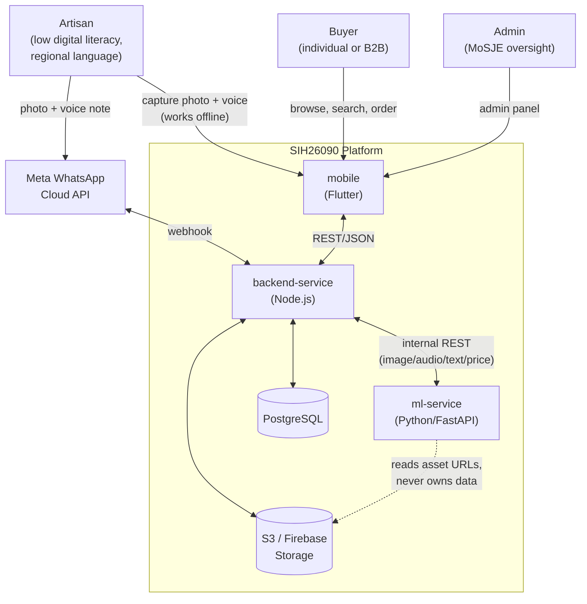
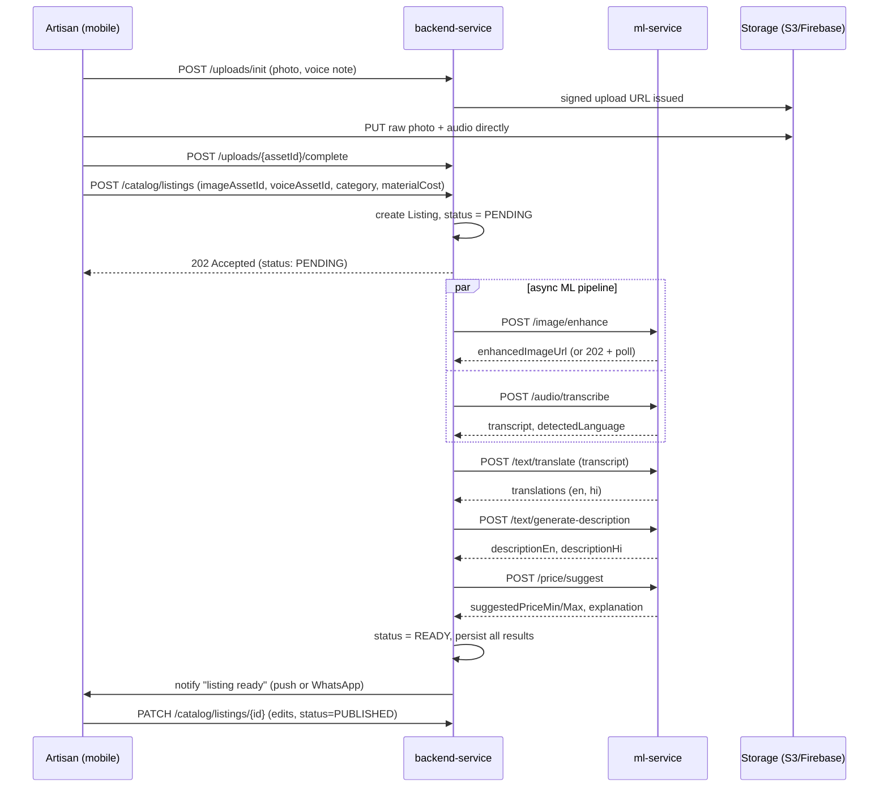
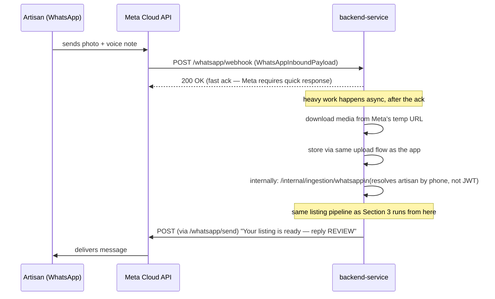
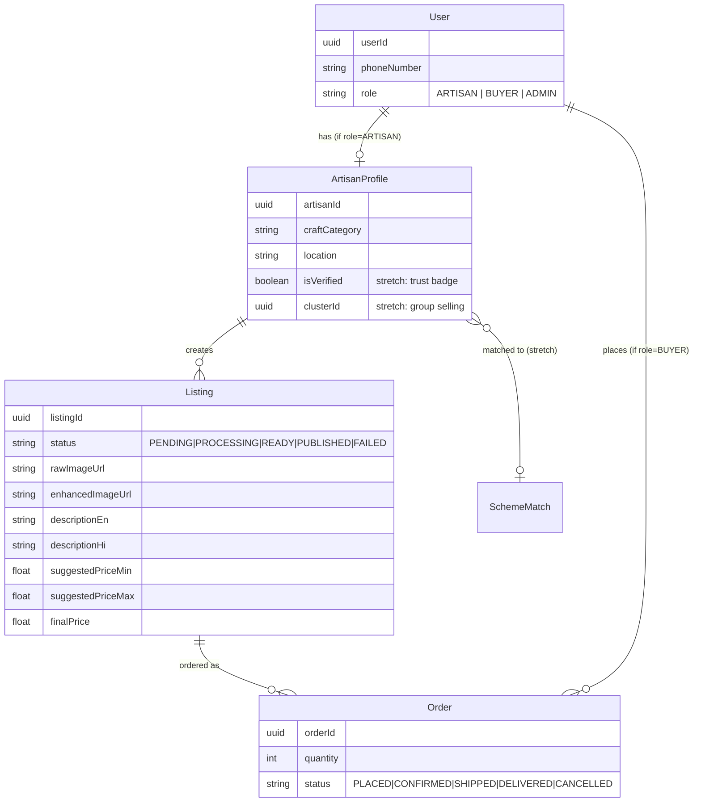
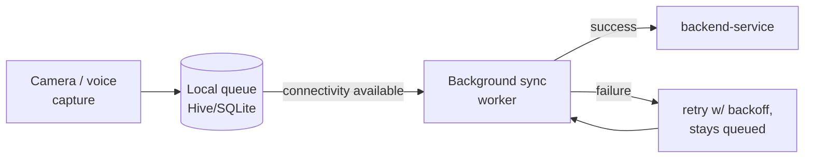

# SIH26090 — System Architecture

**AI-Driven Market Linkage & Smart Cataloging App for Marginalized Artisans**

This is the technical reference for how the system fits together — service boundaries, data flow, contracts, and the honest list of what's built vs. still a stub. See [`ROADMAP.md`](ROADMAP.md) for the build plan and [`Srijan.pdf`](Srijan.pdf) for the product charter.

---

## 1. System context

**Two backend services, matching two backend developers.** `backend-service` is the only service that talks to the database — it owns auth, catalog/order CRUD, admin, WhatsApp, notifications, and orchestration. `ml-service` is a stateless inference worker with no persistence and no business logic; it only transforms inputs to outputs and hands results back.

This replaces an earlier 3-service split (a separate Spring Boot core API + Node.js realtime layer + Python ML). It was consolidated once actual headcount settled at 2 backend developers — see `ROADMAP.md`'s architecture change log for why.

---

## 2. Service breakdown

| Service | Stack | Owns | Talks to DB? |
|---|---|---|---|
| `backend-service` | Node.js / Express | Auth, artisan profiles, catalog, orders, admin, WhatsApp, notifications, orchestration | **Yes** — only service that does |
| `ml-service` | Python / FastAPI | Image enhancement, ASR, translation, description generation, price suggestion | No — stateless worker |
| `mobile` | Flutter | Capture UI, offline queue, catalog browse, review-and-publish | No — client only |

Contracts: [`contracts/backend-service-contract.yaml`](contracts/backend-service-contract.yaml), [`contracts/ml-service-contract.yaml`](contracts/ml-service-contract.yaml). These are the frozen source of truth — a service shouldn't guess at another's shape.

---

## 3. Core data flow — listing creation journey

This is the system's single most important path — everything else supports it.

**Status is the contract for failure.** `PENDING → PROCESSING → READY → PUBLISHED` (+ `FAILED`/`PARTIAL`) — no silent drops. If any ML step fails or times out, the listing surfaces an `errorMessage` rather than getting stuck. The artisan always sees and can edit the AI's output before it goes live — the system drafts, the artisan decides.

---

## 4. WhatsApp bot flow

The lowest-friction entry point — meets the artisan in an app they already use daily, no new app required.

Two paths create the exact same `Listing` record — the app path resolves the artisan via JWT, the WhatsApp path resolves via phone number. Everything downstream (ML pipeline, review, publish) is identical.

---

## 5. Data model

`Listing.status` is the single most load-bearing field in the schema — every consumer (mobile UI, WhatsApp notifications, admin panel) branches on it.

---

## 6. Security boundaries

- **`bearerAuth` (JWT)** — client-facing. Issued by `/auth/login`, `/auth/otp/verify`. Used by mobile app calls (artisan profile, catalog writes, orders).
- **`internalApiKey` (`X-Internal-Api-Key` header)** — service-to-service only, between `backend-service` and `ml-service`. Never exposed to any client. Keeps the ML boundary off the public surface — `ml-service` should be unreachable from the internet in production, reachable only from `backend-service`'s network.
- **Unauthenticated, intentionally public:** `GET /catalog/listings` (buyer browse — no login wall for discovery), `GET /health` on every service.

---

## 7. Offline-first (mobile)

Photos and voice notes are captured and queued locally regardless of connectivity — this isn't a fallback path, it's the primary path, because the target user's connectivity is assumed patchy by default. Sync is opportunistic and retried, never blocking capture.

---

## 8. Deployment view

**Local/dev:** `docker-compose.yml` at the repo root spins up `backend-service`, `ml-service`, PostgreSQL, and Redis together for integration testing. `mobile` runs separately via `flutter run`.

**Production (not yet built):** each service deploys independently — `backend-service` and `ml-service` to any container host (Render/Railway/Fly.io are reasonable free-tier options), PostgreSQL managed separately, assets in S3/Firebase Storage, Redis for caching/session/job-queue if async load grows. `ml-service` should sit on a network boundary not directly internet-exposed, reachable only by `backend-service`.

---

## 9. Known gaps — read before assuming any of this is "done"

This section exists so nobody mistakes an architectural placeholder for a working feature.

| Area | Current state | What's actually missing |
|---|---|---|
| `mobile` | Real Flutter project scaffolded (`pubspec.yaml`, platform folders, `lib/main.dart`) | Still just the generated default app — onboarding, capture flow, offline queue, catalog UI all need building |
| Buyer discovery / distribution | `GET /catalog/listings` exists and works | Nothing brings buyers *to* the catalog — no SEO, no marketplace push, no outreach mechanism. Publishing a listing ≠ anyone finding it |
| ONDC integration | `/ondc/webhook` stub in the contract | No real Beckn protocol compliance, no network registration, no signing — see Section 10 |
| GeM (Government e-Marketplace) | Not started, not even in stretch goals yet | This may be the more literal reading of the PS's "government e-marketplace" phrase — worth a team decision, see `ROADMAP.md` Section 0 |
| Amazon Karigar / Flipkart Samarth | Not integrated | These are separate artisan seller-onboarding programs on those platforms; at most this app could pre-fill data for manual submission, not auto-create accounts |
| `backend-service` business logic | `/health` only, real skeleton in place | Auth, catalog CRUD, orchestration are all still to be built by the Node.js developer |
| `ml-service` business logic | `/health` only, real skeleton in place | All 5 ML endpoints are still to be built |
| Real ML models | Not yet wired | `rembg`, Whisper/IndicWhisper, IndicTrans2/NLLB, pricing regression all need actual integration, not just contract shapes |

---

## 10. ONDC — what a "mocked but honest" integration looks like

Full detail already covered in team discussion; summarized here for reference. ONDC is a network protocol (Beckn), not a single API call. A structurally-correct mock:

1. Inbound `search` action hits `POST /ondc/webhook`
2. Handler queries our own catalog internally (`GET /catalog/listings?query=...`)
3. Responds with an `on_search`-shaped payload mapping our `Listing` fields into Beckn's schema

This proves the integration seam exists without claiming real network membership (which requires gateway registration and cryptographic signing we don't have). Be explicit about this distinction in any demo or pitch — a mock that's presented as "we're on ONDC" is a credibility risk; a mock presented as "here's where a certified connection would plug in" is an honest, still-impressive answer.

**Amazon and Flipkart are not part of the ONDC network** — don't conflate "ONDC-ready" with "reaches Amazon/Flipkart buyers." They're separate ecosystems entirely.
