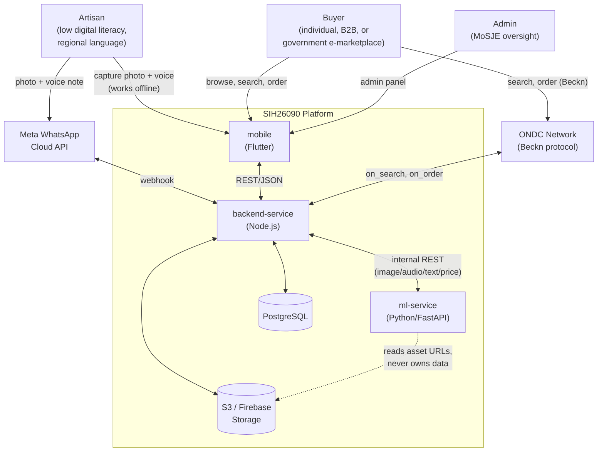
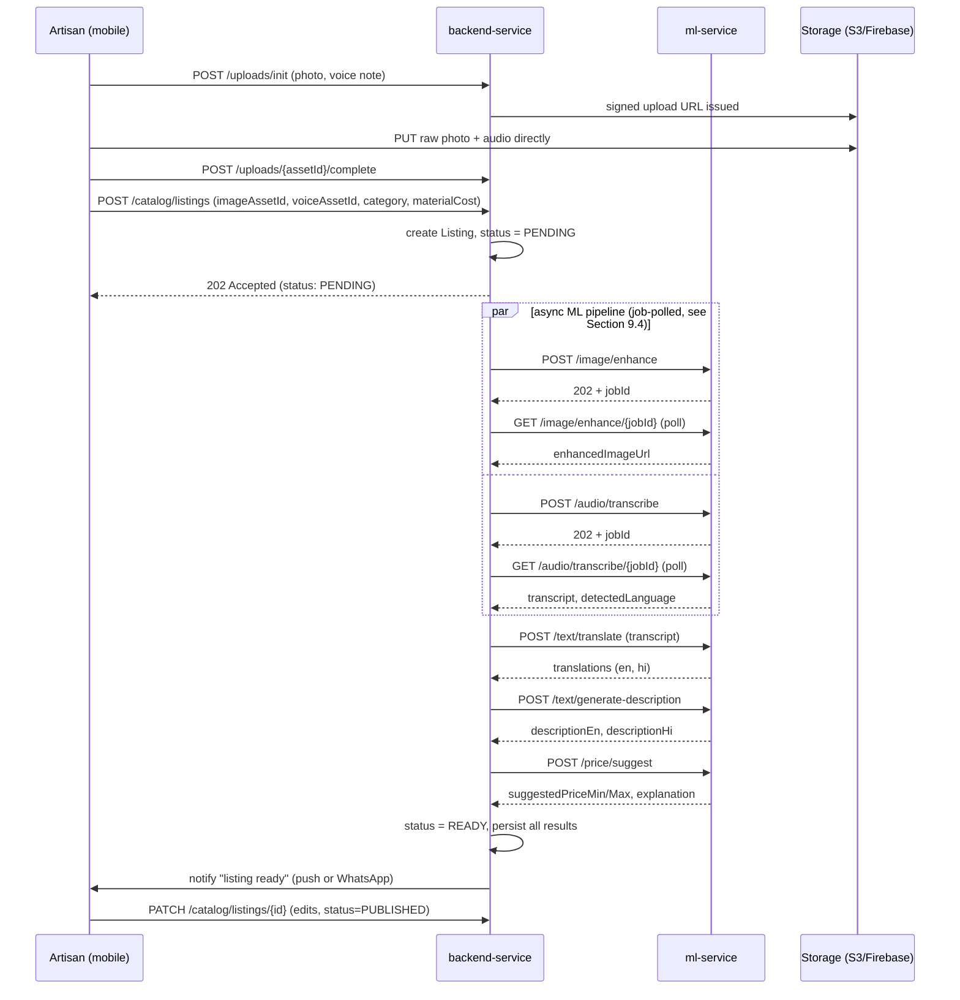
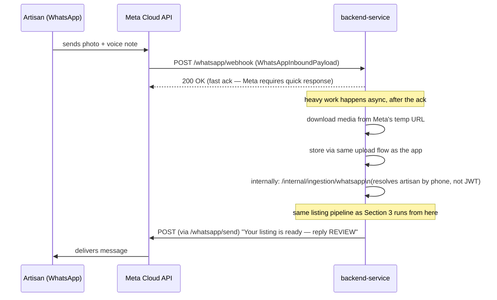
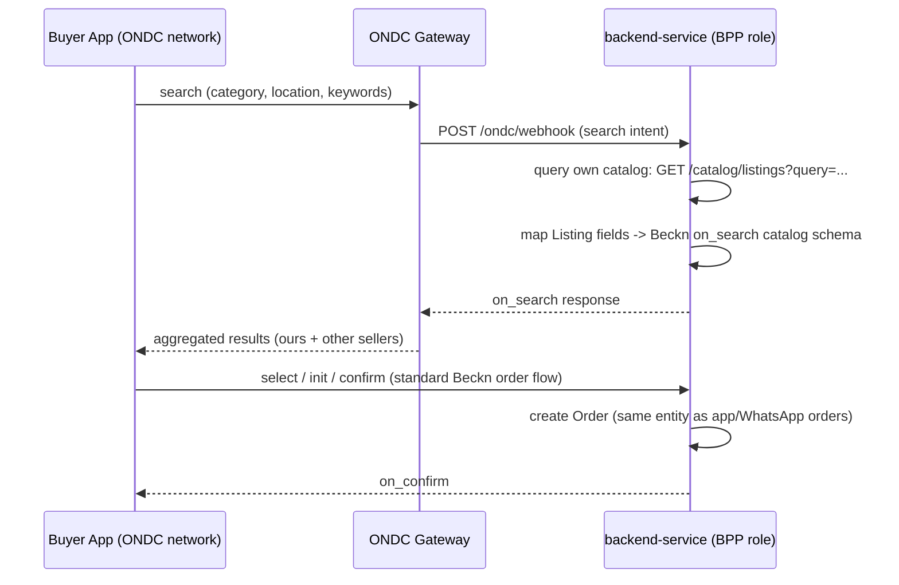
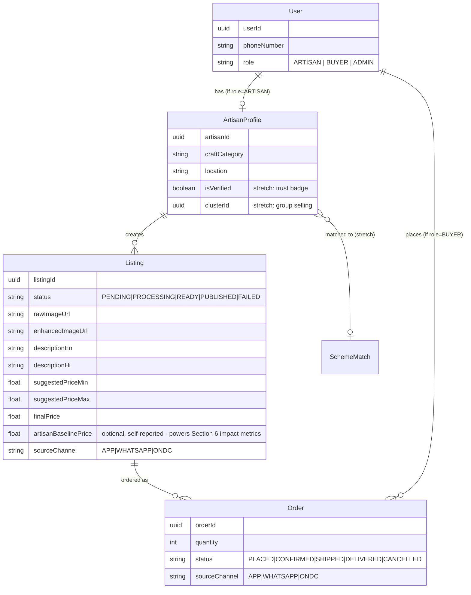
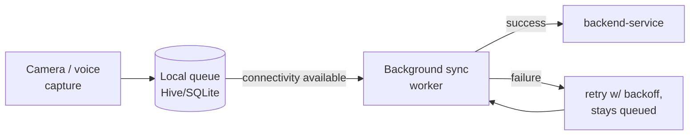

# SIH26090 — System Architecture

**AI-Driven Market Linkage & Smart Cataloging App for Marginalized Artisans**

This is the technical reference for how the system fits together — service boundaries, data flow, contracts, non-functional stance, and the honest list of what's built vs. still a stub. See [`ROADMAP.md`](ROADMAP.md) for the build plan and [`Srijan.pdf`](Srijan.pdf) for the product charter.

---

## 1. System context

**Two backend services, matching two backend developers.** `backend-service` is the only service that talks to the database — it owns auth, catalog/order CRUD, admin, WhatsApp, ONDC, notifications, and orchestration. `ml-service` is a stateless inference worker with no persistence and no business logic; it only transforms inputs to outputs and hands results back.

This replaces an earlier 3-service split (a separate Spring Boot core API + Node.js realtime layer + Python ML). It was consolidated once actual headcount settled at 2 backend developers — see `ROADMAP.md`'s architecture change log for why.

---

## 2. Service breakdown

| Service | Stack | Owns | Talks to DB? |
|---|---|---|---|
| `backend-service` | Node.js / Express | Auth, artisan profiles, catalog, orders, admin, WhatsApp, ONDC connector, notifications, orchestration | **Yes** — only service that does |
| `ml-service` | Python / FastAPI | Image enhancement, ASR, translation, description generation, price suggestion | No — stateless worker |
| `mobile` | Flutter | Capture UI, offline queue, catalog browse, review-and-publish, impact dashboard | No — client only |

Contracts: [`contracts/backend-service-contract.yaml`](contracts/backend-service-contract.yaml), [`contracts/ml-service-contract.yaml`](contracts/ml-service-contract.yaml). These are the frozen source of truth — a service shouldn't guess at another's shape.

---

## 3. Core data flow — listing creation journey

This is the system's single most important path — everything else supports it.

**Status is the contract for failure.** `PENDING → PROCESSING → READY → PUBLISHED` (+ `FAILED`/`PARTIAL`) — no silent drops. If any ML step fails or times out, the listing surfaces an `errorMessage` rather than getting stuck. The artisan always sees and can edit the AI's output before it goes live — the system drafts, the artisan decides.

---

## 4. WhatsApp bot flow

The lowest-friction entry point — meets the artisan in an app they already use daily, no new app required.

Two paths create the exact same `Listing` record — the app path resolves the artisan via JWT, the WhatsApp path resolves via phone number. Everything downstream (ML pipeline, review, publish) is identical.

---

## 5. B2B & government e-marketplace connection (ONDC)

The official problem statement names this explicitly in its *Expected Solution*, not just as an impact goal — it is not optional scope. This section supersedes the earlier "known gap" framing: it's a planned integration, sequenced early, not a last-in-line stretch goal.

**What we are building — a structurally honest ONDC (Beckn protocol) seller-side connector:**

**What "structurally honest" means here:**
- `/ondc/webhook` is a real, working endpoint that correctly parses Beckn `search` actions and responds with a correctly-shaped `on_search` payload built from our real catalog data — not a hardcoded fixture.
- The `select → init → confirm` order flow reuses the exact same `Order` entity and status machine as app/WhatsApp orders — ONDC is a third ingestion channel into one order pipeline, not a parallel system.
- **What this deliberately does not claim:** real ONDC network membership, which requires gateway registration and cryptographic request signing we do not have credentials for. The demo and pitch must say explicitly *"here's where a certified connection plugs in"* — never *"we're live on ONDC"*. A mock presented as the real thing is a credibility risk with judges who know the protocol; a mock presented honestly as a structurally-correct integration seam is still a strong, differentiated answer to the PS's explicit ask.

**Government e-Marketplace (GeM) — separate decision, not yet made.** GeM may be the more literal reading of the PS's "government e-marketplace" phrase (as opposed to ONDC, which is a general digital-commerce network the government sponsors). GeM has its own seller-onboarding process outside Beckn. Team decision needed: either (a) treat ONDC as satisfying this requirement and say so explicitly in the pitch, or (b) scope a second thin connector. Track this decision in `ROADMAP.md` §0.

**Amazon Karigar / Flipkart Samarth** are separate, non-ONDC seller-onboarding programs. At most this platform could pre-fill an artisan's product data for manual submission to those programs — it cannot auto-create seller accounts on them. Don't conflate these with ONDC in the pitch.

---

## 6. Impact measurement

The PS's *Impact Goals* are specific and testable — "provide a continuous digital sales channel," "increase average annual income" — but a platform that only *asserts* this delivers a weaker pitch than one that *shows* it. This is cheap to build (it's aggregation over data we already capture) and should not be treated as optional polish.

**Artisan-facing impact summary** (surfaced on a dashboard/profile screen in `mobile`, computed by `backend-service`):
- Listings published, and how many are currently live.
- Total orders and estimated revenue through the platform, by month — this is the direct evidence for "continuous, year-round" access vs. the periodic-fair baseline the PS's *Background* section describes.
- Average suggested price vs. any artisan-entered "what I'd normally sell this for" baseline (optional field at listing creation) — this is the most direct, demoable evidence of the "increase income" goal, because it's a before/after number the artisan themselves anchors.
- Channel breakdown (app vs. WhatsApp vs. ONDC) — shows the multi-channel reach claim isn't just architectural, it's used.

**Data model addition:** `Listing` gains an optional `artisanBaselinePrice` field (self-reported, nullable) captured at creation time. Everything else is a query over existing `Listing`/`Order` rows — no new service, no new ML model.

**Why this belongs in architecture, not just the pitch deck:** if it's not planned as a real screen backed by a real query, it either doesn't happen or gets faked with static numbers at the last minute — both worse than building the actual (simple) aggregation query early.

---

## 7. Data model

`Listing.status` is the single most load-bearing field in the schema — every consumer (mobile UI, WhatsApp notifications, admin panel) branches on it. `sourceChannel` on both `Listing` and `Order` is what makes Section 6's channel-breakdown metric possible without guesswork.

---

## 8. Offline-first (mobile)

Photos and voice notes are captured and queued locally regardless of connectivity — this isn't a fallback path, it's the primary path, because the target user's connectivity is assumed patchy by default. Sync is opportunistic and retried, never blocking capture.

---

## 9. Non-functional requirements

The PS asks for a "robust, scalable backend architecture" as a named requirement, not an implementation detail left to judgment calls late in the build. This section makes that claim concrete and checkable, rather than asserted.

### 9.1 Observability
- Every service logs structured JSON (not free-text) with a correlation id (`listingId` or `requestId`) threaded through backend-service → ml-service calls, so a failure in the ML pipeline can be traced back to the specific listing and request that triggered it.
- `/health` on every service reports real dependency status (DB reachable, not just "process is up") — `modelsLoaded` on `ml-service`'s `/health` already does this for its models; `backend-service`'s `/health` should do the same for its Postgres connection.
- Minimum error visibility: failures that flip a `Listing` to `FAILED` are logged with enough context (which step failed, upstream error) to debug without reproducing live, and are surfaced in `errorMessage` so the *artisan* isn't just left with a stuck listing.

### 9.2 Security & privacy
- **`bearerAuth` (JWT)** — client-facing. Issued by `/auth/login`, `/auth/otp/verify`. Used by mobile app calls (artisan profile, catalog writes, orders).
- **`internalApiKey` (`X-Internal-Api-Key` header)** — service-to-service only, between `backend-service` and `ml-service`. Never exposed to any client. `ml-service` should be unreachable from the internet in production, reachable only from `backend-service`'s network.
- **Unauthenticated, intentionally public:** `GET /catalog/listings` (buyer browse — no login wall for discovery), `GET /health` on every service.
- **PII handling:** artisan phone numbers, raw (pre-enhancement) photos, and raw voice notes are personal data captured from a vulnerable user population — they should have an explicit retention policy (e.g., raw uploads purged N days after a listing reaches `PUBLISHED` or `FAILED`, keeping only the enhanced/derived assets), not be kept indefinitely by default. This needs a concrete number before launch, not just "we'll handle it."
- **WhatsApp inbound media** is downloaded from Meta's temporary URL and re-hosted in our own storage — never proxied or linked directly — so a webhook replay or URL leak can't expose an artisan's raw media after the fact.

### 9.3 Rate limiting & abuse protection
- Public unauthenticated endpoints (`GET /catalog/listings`, the ONDC webhook) need basic rate limiting — both are open to the internet by design, which makes them the platform's actual attack surface.
- `backend-service` → `ml-service` calls should have a request timeout and a small retry budget (not unbounded retries) so one slow ML call can't cascade into a stuck orchestration thread.

### 9.4 Scalability & reliability stance
- Both `backend-service` and `ml-service` are stateless at the request level (all state lives in Postgres/Storage), so horizontal scaling is "run more instances behind a load balancer," not an architecture change — this is a deliberate design choice, worth stating plainly in the pitch as evidence of the "scalable" requirement.
- **ML calls use the async job pattern for real, not just in the contract.** Image enhancement and ASR transcription are the two calls with meaningfully variable latency (bigger photo, longer voice note); both `POST` endpoints return `202 Accepted` + `jobId` immediately, with the caller polling `GET .../{jobId}`. This keeps a single slow inference call from blocking an HTTP request/response cycle or timing out a live demo. Translation, description generation, and pricing are fast enough to stay synchronous.
- Redis is introduced specifically to back the job-status store for the async pattern above (and is a natural fit for later caching of `/catalog/listings` reads) — see `docker-compose.yml` for local wiring.
- Pre-warm ML models (load them at service startup, not on first request) so the first real request of a session isn't the slowest one — relevant for both normal traffic and live demos.

---

## 10. Deployment view

**Local/dev:** `docker-compose.yml` at the repo root spins up `backend-service`, `ml-service`, PostgreSQL, and Redis together for integration testing. `mobile` runs separately via `flutter run`.

**Production:** each service deploys independently — `backend-service` and `ml-service` to any container host (Render/Railway/Fly.io are reasonable free-tier options), PostgreSQL managed separately, assets in S3/Firebase Storage, Redis for the async job-status store and caching. `ml-service` should sit on a network boundary not directly internet-exposed, reachable only by `backend-service`.

---

## 11. Known gaps — read before assuming any of this is "done"

This section exists so nobody mistakes an architectural placeholder for a working feature.

| Area | Current state | What's actually missing |
|---|---|---|
| `mobile` | Real Flutter project scaffolded (`pubspec.yaml`, platform folders, `lib/main.dart`) | Onboarding, capture flow, offline queue, catalog UI, and the Section 6 impact dashboard all need building |
| Buyer discovery / distribution | `GET /catalog/listings` exists and works | SEO and general marketplace push are still open; ONDC (Section 5) is the planned structural answer to "reach buyers beyond our own app," not yet built |
| ONDC integration | Concrete plan in Section 5 | Not yet implemented — `/ondc/webhook`, the catalog-to-Beckn mapping, and the reused `Order` flow all need building |
| GeM (Government e-Marketplace) | Not started | Team decision needed on whether ONDC satisfies the PS's "government e-marketplace" phrase or a second connector is required — see Section 5 |
| Amazon Karigar / Flipkart Samarth | Not integrated | Separate artisan seller-onboarding programs on those platforms; at most this app could pre-fill data for manual submission, not auto-create accounts |
| `backend-service` business logic | `/health` only, real skeleton in place | Auth, catalog CRUD, orchestration, and the async job-status store (Section 9.4) are all still to be built |
| `ml-service` business logic | `/image/enhance` and `/price/suggest` built synchronously; `/audio/transcribe`, `/text/translate`, `/text/generate-description` in progress | Async job pattern (Section 9.4) not yet wired into any endpoint — currently all synchronous |
| Impact measurement (Section 6) | Data model field (`artisanBaselinePrice`, `sourceChannel`) specified | No aggregation endpoint or dashboard screen built yet |
| Observability (Section 9.1) | Not implemented | No structured logging or correlation ids wired yet |
| Data retention policy (Section 9.2) | Not decided | Needs an explicit retention window for raw PII before launch |
