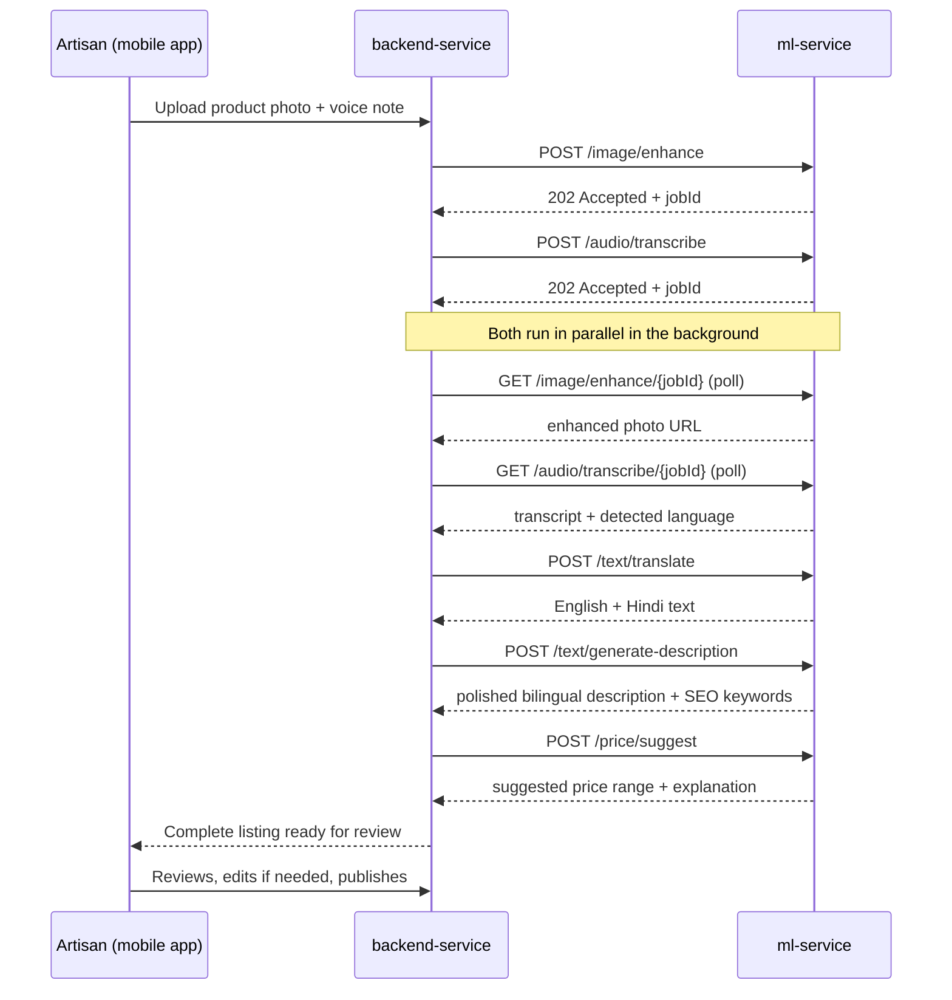

# ML Service — Overview & Workflow

**Srijan / SIH26090 — AI-Driven Market Linkage & Smart Cataloging App for Marginalized Artisans**

> Prepared as source material for presentation slides. Each `##` section below is intended to map roughly to one slide; bullets are kept short on purpose.

---

## 1. What `ml-service` Is

- The **AI brain** of the Srijan platform — a Python/FastAPI microservice that turns a raw product photo and a spoken voice note into a polished, priced, bilingual e-commerce listing.
- **Stateless by design:** it owns no business data, no database — it only transforms inputs into outputs and hands results back.
- Called internally by `backend-service` (Node.js) — never called directly by the mobile app or the public internet.
- Directly implements the SIH problem statement's three mandated AI features:
  1. AI Image Enhancer & Studio
  2. Multilingual Auto-Cataloger
  3. Dynamic Pricing Assistant

---

## 2. Why This Matters (the problem it solves)

- Artisans often can't professionally photograph, describe, or price their products for online sale.
- `ml-service` removes that barrier entirely: **speak in your own language, take one photo — get a store-ready listing.**
- No technical skill, no English requirement, no photography equipment needed.

---

## 3. Technology Stack

| Layer | Technology |
|---|---|
| Framework | Python, FastAPI |
| Background removal | `rembg` (u2net model) |
| Lighting correction | OpenCV — CLAHE (adaptive histogram equalization) |
| Blemish/dust removal | OpenCV — non-local-means denoising |
| Speech-to-text | Groq-hosted Whisper (`whisper-large-v3-turbo`) |
| Translation & description writing | Google Gemini |
| Pricing | Transparent arithmetic (no black-box model) |
| Async processing | FastAPI `BackgroundTasks` + in-memory job store |

---

## 4. The Five Capabilities

### 4.1 Image Enhancement — `/image/enhance`
- **Input:** a raw product photo (URL)
- **Pipeline:** lighting correction (CLAHE) → background removal (`rembg`) → blemish/dust denoising → crop & resize to a centered 1000×1000 e-commerce square
- **Output:** a clean, studio-style product photo on a white background
- **Mode:** asynchronous (`202` + poll) — background removal time varies with image size
- ✅ **Verified working** on a real product photo during development testing

### 4.2 Audio Transcription — `/audio/transcribe`
- **Input:** artisan's voice note (URL), optional language hint
- **Pipeline:** Groq-hosted Whisper — auto-detects the spoken regional language, transcribes to text
- **Output:** transcript + detected language + confidence score
- **Mode:** asynchronous (`202` + poll)
- ✅ **Verified working** on a real Hindi voice note — correctly captured product details and price mentioned by the artisan

### 4.3 Translation — `/text/translate`
- **Input:** transcribed text + source language + target languages (e.g., English, Hindi)
- **Pipeline:** Gemini, prompted to translate faithfully without adding or omitting details
- **Output:** translations in each requested language
- **Mode:** synchronous (fast enough not to need polling)

### 4.4 Description Generation — `/text/generate-description`
- **Input:** English translation + product category
- **Pipeline:** Gemini, prompted to write SEO-friendly copy **using only facts already stated** — explicitly forbidden from inventing materials, measurements, or claims
- **Output:** polished English + Hindi descriptions, SEO keywords
- **Mode:** synchronous

### 4.5 Dynamic Pricing — `/price/suggest`
- **Input:** product category, optional material cost, optional region
- **Pipeline:** transparent arithmetic — category base price range (from curated reference data) × regional demand multiplier, with a material-cost floor
- **Output:** a price **range** (not a single number) with a human-readable explanation of the reasoning
- **Mode:** synchronous
- **Design principle:** deliberately explainable, not a black-box model — judges and artisans can see exactly why a price was suggested

---

## 5. End-to-End Workflow

**Plain-language version of the same flow:**
1. Artisan takes a photo and records a voice note describing their product.
2. Photo and audio are sent to `ml-service` — image cleanup and voice transcription happen **at the same time**, not one after another.
3. Once transcribed, the text is translated into English and Hindi.
4. The English text becomes a polished, SEO-friendly bilingual product description.
5. A fair, explainable price range is calculated from category data, material cost, and region.
6. Everything comes back together as one complete draft listing.
7. **The artisan always reviews and can edit before publishing — the AI drafts, the artisan decides.**

---

## 6. Key Design Principles

- **Stateless & swappable:** every AI provider sits behind a clean function boundary — Groq or Gemini can be replaced without touching the rest of the system.
- **Explainable, not opaque:** pricing is transparent arithmetic with a written-out reason, not an unexplainable model output.
- **No hallucination, by instruction:** translation and description prompts explicitly forbid inventing facts not present in the artisan's own words.
- **Graceful degradation:** every failure mode (silent audio, blurry image, empty transcript) returns a clear error rather than a broken or fabricated result.
- **Async where it matters:** image and audio processing (the two slowest steps) never block a request — they return instantly with a job ID to poll.

---

## 7. Current Status

| Capability | Status |
|---|---|
| Image enhancement | ✅ Built & tested with real sample photo |
| Audio transcription | ✅ Built & tested with real sample voice note |
| Translation | ✅ Built & tested end-to-end |
| Description generation | ✅ Built & tested end-to-end |
| Pricing | ✅ Built & tested — arithmetic model with curated reference data |

All five capabilities have been verified working together, end-to-end, producing a real bilingual, priced product listing from a real photo and a real voice recording.
